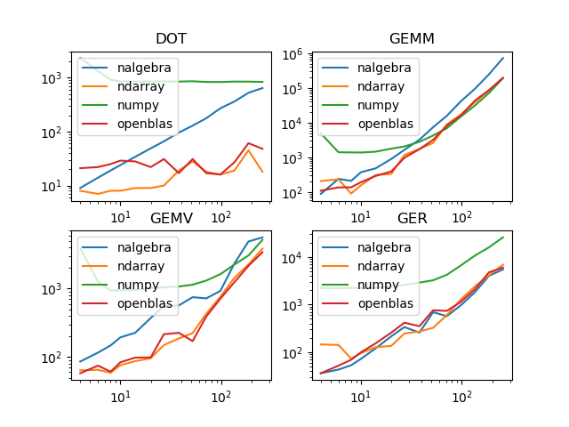

## Benchmarks for Rust Linear Algebra Packages

We tested the following packages for performance:

* [nalgebra](https://nalgebra.org/)
* [ndarray](https://github.com/rust-ndarray/ndarray)
* [NumPy](https://numpy.org/) (pure python)
* [OpenBLAS](https://www.openblas.net/) (pure C)

The OpenBlas and NumPy implementations serve as a reference point. Any library should be no slower than NumPy, and ideally as fast as direct calls to OpenBlas.

To keep tests consistent, we ensure that we're only using one thread. In some cases we need to set the `OMP_NUM_THREADS=1` environment variable.

We also looked at the following libraries but skipping for the following reasons:

* [simd_linalg](https://github.com/s3bk/simd_linalg) - only handles `dot` and `gemv`
* [vek](https://docs.rs/vek/0.14.1/vek) - only handles up to 4x4 matrices

Maybe as these libraries improve over time we can take a look, but considering how far behind they are to the others, it might be a while before they ever catch up.

### Compiler Dependencies

You will need to install OpenBlas and Fortran:

```bash
sudo apt install libopenblas-dev gfortran
```

### Running the Benchmarks

There is a Makefile included, which you can just invoke with `make`. This will run all the Rust, Python and C benchmarks in one go.

### Results

* nalgebra is quite slow, slower than NumPy in some cases (specially in GEMM).
* Numpy seems to have a 1 usec minimum latency for any function call.
* ndarray provides good performance overall, as good as pure OpenBLAS.
* ndarray beats pure OpenBLAS for the `dot` product, which is interesting.



NOTE - all timings above (the y-axis) are in nanoseconds.

### Conclusions

Let's use `ndarray`, just make sure we compile it with OpenBLAS.

#### Using ndarray with OpenBLAS

Without OpenBLAS, ndarray is actually very slow. To enable it, add this to your `Cargo.toml`:

```
ndarray = { version = "0.14", features = ["blas"] }
blas-src = { version = "0.6.1", default-features = false, features = ["openblas"] }
openblas-src = { version = "0.9", default-features = false, features = ["cblas", "system"] }
```
